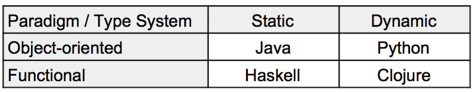

# Prologue

This book was originally written for the course *Advanced Sofware Design*, imparted
at Uppsala University by Dave Clarke and Kiko Fernandez-Reyes, and provides a practical
hands-on experience on software design. It extends the content of the course with
a direct application of design patterns and software principles in
the functional and object-oriented paradigms while also considering their
type system in a static and dynamic language.

<!-- In general, the idea of this book is to point out the differences in design -->
<!-- patterns and well-known software principles applied to different paradigms. -->

## Who is this book for?

This book is directed to students of any computer science major,
young developers, engineers or programmers who have already grasped the idea
behind object-oriented and/or functional programming. This book can still be used by
those who have knowledge in an object-oriented language or a functional language
althought, to get the most out of it, it is recommended to be familiar with
both paradigms.

The reader should **already** be familiar with the following concepts
from object-oriented programming:

- Classes,
- objects,
- inheritance,
- interfaces,
- abstract classes,
- parametric classes
- mixins and
- traits

and the following concepts from functional programming:

- Anonymous functions / lambdas,
- high-order functions,
- parametric functions,
- algebraic data types,
- multi-functions,
- immutability,
- monads and
- arrows

For those who just need a quick reminder, we have included a
*recap* chapter  that summarises these concepts. If you are not familiar with
neither object-oriented programming nor functional programming, you should
first understand the ideas behind these paradigms and come back later to this book.

## What is covered in this book?

This book covers most of the design principles and design patterns used today in industry,
necessary for building maintable and flexible applications.
All the principles and design patterns are written in
four languages: Java, Python, Haskell and Clojure.
<!-- -->
These languages are already used in production in big companies and are
well established. For instance, Boeing uses Clojure in their onboard
diagnostic system, Facebook uses Haskell to prevent spam and phising attacks
in their site, Pinterest uses Python for their backend operations and
Java is widely used everywhere.

The mix of these languages covers two different paradigms (object-oriented and functional
programming) and two different kinds of type systems (static and dynamic), shown in Table 1.1.

*Tabla 1.1 Relation between paradigm and type system*

**Why multiple languages?**

Each language has its strengths and weaknesses. In this book,
I show how to apply the same design pattern by fully exploiting
the main strengths of each language.

<!-- You should choose the right language for the right job. -->
Choosing a language
is an important design decision as languages are tied to a paradigm and a type system,
and these cannot be changed.
<!--   -->
For instance, Python has some functional features but, all in all,
**Python is an object-oriented language**. Consider using Python for the things
it is good for. Should I tell you what it is good for? ummm... Not that fast young padawan, it's
only through the journey that one finds its own truth.

In this book, we do not provide an absolute truth nor do we try to do so, we merely
**show that the combination of different paradigms and type systems have inherent
benefits and drawbacks**. You have to work the examples in the book to find your
own truth and comfort zone.

## Organisation

The book is organised in 6 parts. The first part (chapters 1 and 2)
puts in perspective what is software design, a recap to object-oriented
and functional programming, as well as the main differences between static and
dynamic type systems. The second part introduces software principles to create
flexible and maintanable software, known as SOLID and GRASP principles. Parts 3 to 5
explain, in depth, core design patterns that are grouped into 3 categories:
creational, structural and behavioral patterns.
The last part builds a text-based game using concepts and design patterns covered in the book.

Each software principles and design pattern is explained in depth:
there is a clear and concise explanation of the design pattern (sometimes ilustrating
a simple simil from the real world), its benefits and drawbacks.
Afterwards, the pattern is explained in the context of its paradigm and type system,
and we include easy to grasp examples to get you familiar with the language and
the design pattern. As mentioned above, for a full example that combines software principles
and patterns, you should refer to the last part.

## Software requirements

This book contains code written in Java, Python, Clojure and Haskell.
This section contains the exact versions of the languages used in this book.
All code contained in this book can be found at
[https://github.com/kikofernandez/asd-book](https://github.com/kikofernandez/asd-book).

### Java 8

All examples written in this book has been tested using the Oracle JDK 8u111.

Instructions on how to install Java can be found in
[http://www.oracle.com/technetwork/java/javase/downloads/jdk8-downloads-2133151.html](http://www.oracle.com/technetwork/java/javase/downloads/jdk8-downloads-2133151.html).

### Haskell

All examples written in this book has been tested in GHC 7.10.2.

Instructions on how to install GHC can be found in [https://www.haskell.org/ghc/](https://www.haskell.org/ghc/).

### Clojure

All examples written in this book has been tested for Clojure 1.8.0.

Instructions on how to install Clojure can be found in [http://clojure.org/community/downloads](http://clojure.org/community/downloads).

### Python 3.6

All examples written in this book has been tested for Python 3.6.0.

Instructions on how to install Python 3.6 can be found
in [https://www.python.org/downloads/](https://www.python.org/downloads/).